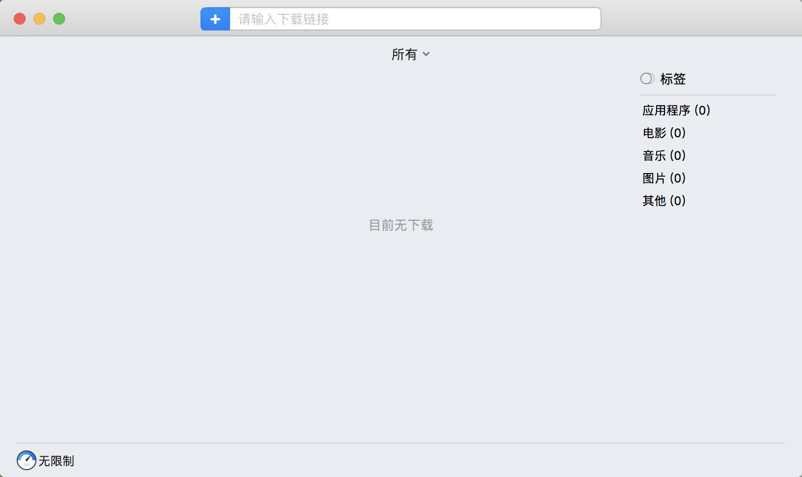
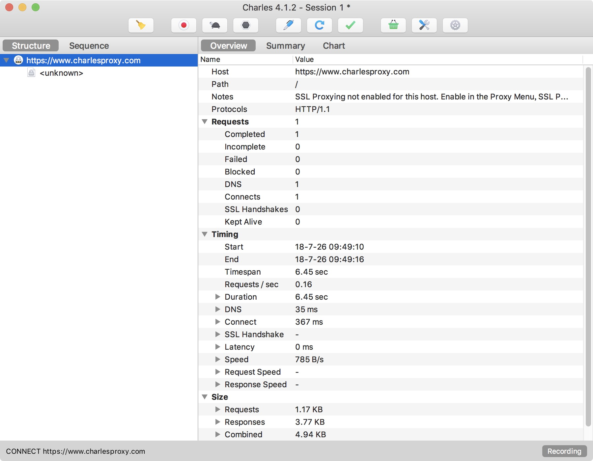
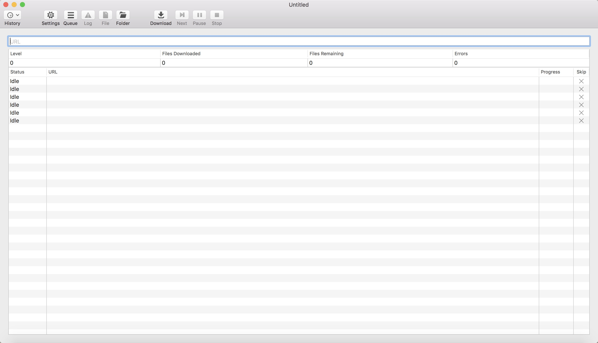
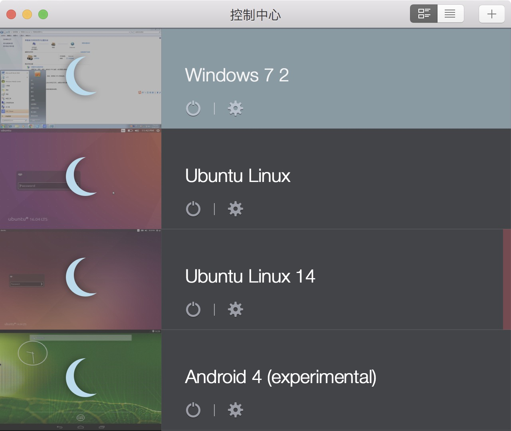
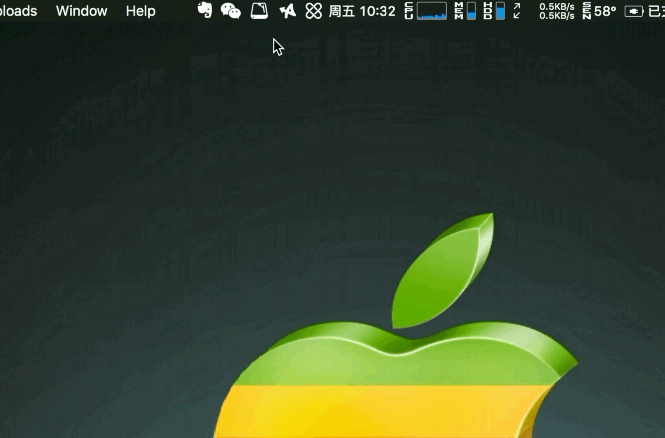
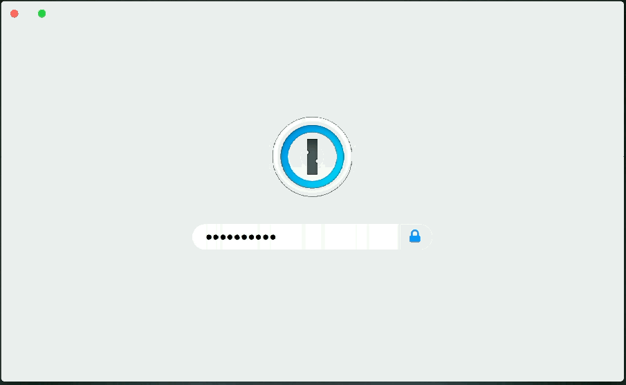
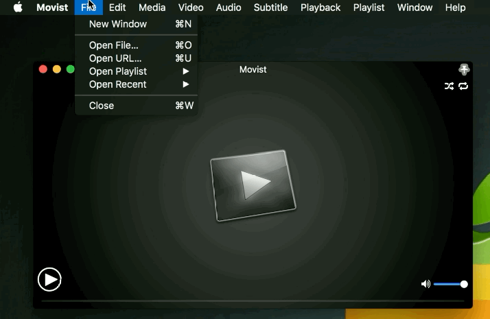

# 收集那些优秀的软件（Windows & Mac）

## Mac

### 前言：

关于Mac上面的软件，有很多优秀的，不过也有很多是不方便的  

我希望通过这些效率软件来提高工作的质量及效率  

对于各种全家桶我就不做介绍了  

欢迎有收藏了优秀软件的积极交流

资金足够请支持正版

****

|Author|vitali|
|---|---
|E-mail|vitaliqp@foxmail.com
|csdn|[CSDN](https://blog.csdn.net/baidu_35154065/article/details/81213468)
|知乎专栏|[优秀软件集合](https://zhuanlan.zhihu.com/vitali-software)

### 工具类集合

* **OmniGraffle pro** [图形工具](./Tools/drawing)
	* 作为一款强大的图形工具，用来绘制图表，流程图，组织结构，构图，心智图，设计网页或者PDF文档原型简直不要更赞了。
	
  

* **FOLX GO+**	  [下载工具](./Tools/download) 
	* 一款超棒的下载工具，优点是下载速度快，支持断点续传，多线程，以及BT等而且可以无缝支持主流浏览器  
	

* **iThoughtsX & Xmind** 思维导图  
	* 这两款不做太多介绍，用过的应该都知道，没用过的人可以试试

* **Charies**  [抓包工具](./Tools/catch) 
	* 这款抓包工具应该也是大家比较熟悉的一款的了，快速，有效   
	

* **SiteSucker**  [扒站工具](./Tools/catch) 
	* 一款扒站软件，可以直接将整个网站下载信息到本地硬盘，而且可以脱机使用			
	

* **PD & VM**  [虚拟机](./Tools/virtual/PD) 
	* 大名鼎鼎的两款虚拟机，功能强大，速度快		
	

* **Jump Desktop**  [远程桌面](./Tools/remoteControl) 
	* 远程桌面控制，支持windows Mac双平台，可以进行TAG保存		
	

* **TeamViewer**  [远程访问](./Tools/remoteControl) 
	* 一款强大的远程访问，桌面共享，还能进行多人会议，可以无人值守访问			
	

### 系统类集合

* **CleanMyMac** [磁盘清理](./System/clean)
	* 对于这款系统清理工具，需要收费，传说还会勿删，不过有钱的可以试试

* **Paste**  [剪切板](./System/Clipboard)
	*	是不是剪切板不够用，这款剪切板可以设置剪切板的最大数 
	* 是不是很多文件格式不能复制到剪切板，它可以满足你的一切

* **Contexts**	[窗口切换](./System/fastSwitching)
	*	想实现应用快速切换么，直接使用快捷键，或者数字能直接打开你需要的应用
	* 还可以在侧边栏隐藏，让你的鼠标进行点击切换 		
	

* **PathFinder**		[文件管理器](./System/fileManager)
	*  文件管理器，能够轻而易举的访问系统文件或者网络硬盘
	*  可以直接隐藏文件
	*  任何显示方式下都可以预览
	*  可以满足多种不同的预览需求
	
	

* **Bartender**		[菜单管理](./System/menu)
	* 	动不动就点错你的菜单？加个二级菜单，或者隐藏你的菜单栏让菜单栏更清爽
	

* **iTools Pro**		[ios管理](./System/mobileManager)
	* 苹果手机管理工具，比较全，可以实时共享桌面，延迟就说不准了
	
	

* **iStat Menus**	[系统监控](./System/monitoring)
	* 系统监控软件，能查看你的CPU，内存，网络，传感器温度，电池信息等
	* 可直接进入系统监控，日志信息查看等
	
	

* **Mounty**		[NTFS](./System/NTFS)
	* 	用来加载windows上的NTFS格式磁盘，免费，很好用

* **Alfred**		[快速搜索](./System/search)
	* 快速搜索你的一切，文件，应用，告别鼠标点来点去
	* 直接包含系统操作，休眠，关机，重启等等		
	

* **Magnet**		[分屏](./System/SplitScreen)
	* 小巧的分屏工具，快捷键让你的屏幕实现快速分屏
	* 可分四分之一，二分之一等等  
	
	

* **BetterTouchTool**	[触控板](./System/touch)
	* 是不是喜欢待在星巴克？是不是不喜欢鼠标键盘？
	* 可以满足一个触控板的所有需求，touchBar也可以玩转起来  
	

* **Archiver/BetterZip**	[解压缩](./System/unzip) 
	* 下方介绍的是Archiver
	* 解压缩工具，非常好用
	* 可加密你的压缩文件
	
	
 

### 生活类集合

* **Boostnote**	[笔记](./Daily/noteManager)  
	* 程序员专用笔记本
	* 支持各种语言的代码编写
	* 支持各种语言的代码片段保存
	

* **1Password**	[密码](./Daily/passwordManager)
	* 随机生成高质量的密码
	* 支持快速搜索已保存账号信息
	* 可保存网站对应账号并直接转到填入
	
  

* **Xee**	[图片预览](./Daily/pictureManager)
	* 	解决Mac图片切换问题
	*  支持几乎所有常见图片格式

	  

* **OmniFocus**	[高级任务管理](./Daily/taskManager)
	* 用了这个，别的不会再想用了

  

* **Downie**	[视频下载](./Daily/videoManager)  
	* 拖拽网址能直接下载视频
	* 支持多个视频网站
	

* **OCRKit Pro**	[文字识别](./Daily/wordsManager)
	* 拖拽文件直接进行扫描
	* 支持多种格式转换 

* **AirMail** [轻量级邮件客户端](./Daily/emailManager)
	* 轻量级邮箱
	* 支持多种账号

* **PDF Expert** 批量级PDF预览  
	* 支持大批量的PDF的预览，例如超过五千张
	* 可惜我没有这个的软件

* **Papers** [文献管理工具](./Daily/papersManager)
	* 一键管理你的论文文献工具

* **Movist** [视频播放器](./Daily/videoPlayerManager)
	*  补足了MPlayerX不足的地方

* **Screen Flow** [屏幕录制](./Daily/screenManager)
	* 支持设置固定录屏时间，生成文件参数
	* 可对生成文件进行处理

### 设计类集合

* **Sketch**	[矢量绘图](./Design/Vector)

* **Sip Pro**	[取色计](./Design/Color)

* **Principle**	[交互设计](./Design/Interactive)

* **Flinto**	可交互设计原型

* **Inpaint**	 [去水印](./Design/Watermark)

* **Axure RP** [原型设计](./Design/Prototype) 

##### -----------------------持续更新中----------------------------  

## 注意事项
***

* **PS:软件解压密码均为：xclient.info**
* **部分软件提供破解程序**
